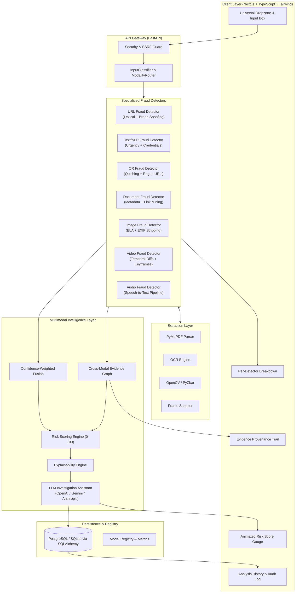

# UAMD — Unified AI Multimodal Fraud Intelligence Framework

[](https://www.python.org/downloads/)
[](https://fastapi.tiangolo.com)
[](https://nextjs.org)
[](https://tailwindcss.com)
[](LICENSE)

An enterprise-grade, upload-anything multimodal fraud detection and intelligence platform. Users paste or drop any suspicious artifact — URLs, QR codes, documents, images, video, text, or audio — and UAMD automatically classifies, extracts, analyzes, fuses evidence, and produces explainable risk intelligence with safe protective recommendations.

---

## 1. Problem

Digital fraud has evolved beyond single-channel attacks. Attackers now orchestrate multi-vector campaigns:
- Phishing lures inside PDF invoices with embedded shortened redirect URLs.
- Malicious QR codes ("quishing") placed inside legitimate-looking images or payment receipts.
- Urgency-laden SMS and WhatsApp messages leading to spoofed authentication domains.
- Deepfake video loops and synthetic identity artifacts.

Traditional detection solutions are fragmented — security teams and end-users must manually triage which tool to use for each artifact. There is no single system that accepts **arbitrary inputs**, discovers secondary relationships across modalities, and fuses them into a calibrated risk score.

---

## 2. Solution

UAMD implements an **Upload-Anything** architecture following the paradigm:

$$\text{UPLOAD} \longrightarrow \text{UNDERSTAND} \longrightarrow \text{ANALYZE} \longrightarrow \text{FUSE} \longrightarrow \text{EXPLAIN} \longrightarrow \text{PROTECT}$$

1. **Automatic Input Classification**: Magic bytes, MIME analysis, and content heuristics identify data types with zero manual selection.
2. **Deep Extraction & Cascading**: Discovers nested modalities (e.g., PDF $\to$ embedded URLs $\to$ phishing detector; Image $\to$ QR $\to$ payment scheme).
3. **Specialized Multimodal Detectors**: Independent micro-models evaluate lexical signals, social engineering patterns, image tampering (ELA), and temporal video anomalies.
4. **Relational Evidence Graph**: Tracks cross-modal provenance chains and applies agreement bonuses.
5. **Configurable Fusion & Risk Engine**: Normalizes and weights detector probabilities into a calibrated 0–100 risk score.
6. **Explainable AI & LLM Investigation**: Contextual, non-hallucinated explanations and defensive action steps.

---

## 3. Architecture



---

## 4. Key Features

- **Universal Ingestion**: Accepts URLs, plain text, SMS, emails, PDFs, DOCX, TXT, PNG, JPG, WEBP, MP4, MOV, WEBM, and MP3/WAV.
- **Cascading Multi-Tier Analysis**: A PDF invoice triggers the Document Detector, mines embedded URLs to run the URL Detector, extracts text to run the NLP Detector, and evaluates cross-modal agreement.
- **Zero-Hallucination Explainability**: Explanations reference real, verified detector outputs and actual signals.
- **Relational Evidence Graph**: Tracks directed edges ($A \xrightarrow{\text{contains}} B \xrightarrow{\text{resolves\_to}} C$) and multiplies confidence when independent detectors agree.
- **Pluggable LLM Investigator**: Configurable support for OpenAI GPT-4o, Google Gemini 1.5, Anthropic Claude 3, or deterministic template fallbacks.
- **Model Registry & Governance**: Tracks versioning, modalities, and verified benchmarks. Unmeasured metrics are honestly labeled as `Not evaluated yet`.
- **Cybersecurity Dark UI**: High-impact SOC-grade interface featuring circular animated SVG gauges, expandable evidence logs, and live history tables.

---

## 5. Supported Inputs & Cascading Behavior

| Input Type | Primary Detector | Cascading Trigger | Secondary Detectors |
| :--- | :--- | :--- | :--- |
| **URL** | URL Fraud Detector | None | Lexical, Domain, TLD, Entropy |
| **TEXT / EMAIL** | Text/NLP Fraud Detector | Extracts URLs & Emails | URL Detector |
| **QR CODE** | QR Fraud Detector | Decodes URLs or Text | URL Detector, Text Detector |
| **PDF / DOCX** | Document Fraud Detector | Extracts Text, Links, OCR | Text Detector, URL Detector |
| **IMAGE** | Image Authenticity (ELA) | Finds embedded QRs & OCR | QR Detector, Text Detector, URL Detector |
| **VIDEO** | Video Temporal Analyzer | Frame OCR & QR detection | Image Detector, Text Detector, QR Detector |
| **AUDIO** | Audio Transcription | Transcribes spoken audio | Text Detector, URL Detector |

---

## 6. Detection Modules & ML Baselines

### URL Fraud Detector (`url-heuristic-v1`)
- **Features Extracted**: Shannon entropy of domain and path, presence of IP address in host, excessive subdomains, suspicious TLDs (`.xyz`, `.top`, `.tk`, `.club`), missing HTTPS, URL shortener detection, and brand impersonation scoring.
- **Output**: Calibrated probability, confidence, and human-readable threat signals.

### Text / NLP Fraud Detector (`text-pattern-v1`)
- **Signals Evaluated**: 250+ regex and semantic indicators spanning artificial urgency, credential phishing, wire transfer/cryptocurrency demands, threat/coercion language, and impersonation.
- **Entity Extraction**: Regex identification of cryptocurrency addresses (Bitcoin, Ethereum), emails, phone numbers, and URLs.

### Document Fraud Detector (`document-analyzer-v1`)
- **Engine**: PyMuPDF (`fitz`) and `python-docx`.
- **Checks**: Missing creator/producer signatures, forged invoices, high-pressure payment verbiage, and automated link extraction.

### Image Fraud Detector (`image-ela-metadata-v1`)
- **Engine**: PIL, NumPy, and OpenCV.
- **Checks**: Error Level Analysis (ELA) divergence indicating resaved or spliced regions, stripped EXIF metadata, and editing tool signatures.

### Video Fraud Detector (`video-temporal-analyzer-v1`)
- **Engine**: OpenCV VideoCapture frame sampling.
- **Checks**: Inter-frame mean absolute difference, sudden artifact flicker, abnormal framerates (<12 fps spoofing loops), and on-screen QR/URL extraction.

---

## 7. Multimodal Fusion & Risk Engine

The fusion engine does not perform a naive unweighted average. It computes a confidence-weighted aggregation:

$$P_{\text{fused}} = \frac{\sum_{i=1}^{N} w_i \cdot c_i \cdot P_i}{\sum_{i=1}^{N} w_i \cdot c_i}$$

Where $w_i$ is the modality weight, $c_i$ is the detector confidence, and $P_i$ is the detector probability.

### Risk Score Scaling (0–100)
$$\text{Score} = \min\left(100, \, \lfloor P_{\text{fused}} \cdot 100 \rfloor + B_{\text{agreement}} + B_{\text{cross-modal}} + B_{\text{critical}}\right)$$

| Score Range | Risk Level | Meaning |
| :--- | :--- | :--- |
| **0 – 20** | `SAFE` | Benign content; no significant risk indicators detected. |
| **21 – 40** | `LOW` | Minor anomalies detected; safe with normal awareness. |
| **41 – 60** | `MEDIUM` | Suspicious signals present; proceed with heightened caution. |
| **61 – 80** | `HIGH` | Strong fraud indicators identified across detectors. |
| **81 – 100** | `CRITICAL` | Severe multi-signal or cross-modal fraud attack detected. |

---

## 8. Technology Stack

- **Backend Framework**: Python 3.11, FastAPI, Pydantic v2, SQLAlchemy 2.0 (Async)
- **Database**: SQLite (`aiosqlite`) for local development; PostgreSQL (`asyncpg`) for production
- **Document & Vision**: PyMuPDF (`pymupdf`), `python-docx`, OpenCV (`opencv-python-headless`), Pillow
- **Frontend Framework**: Next.js 16 (App Router), React 19, TypeScript
- **Styling**: Tailwind CSS v4, Lucide Icons, Custom Animated SVGs
- **ML & Analytics**: NumPy, Scikit-learn, Tldextract

---

## 9. Project Structure

```text
uamd/
├── backend/
│   ├── app/
│   │   ├── api/
│   │   │   └── routes/         # analyze, history, health, monitoring
│   │   ├── core/               # config, security, logging
│   │   ├── db/                 # SQLAlchemy database models & session
│   │   ├── detectors/
│   │   │   ├── url/            # URL features & detector
│   │   │   ├── text/           # Text patterns & NLP detector
│   │   │   ├── qr/             # QR code fraud detector
│   │   │   ├── document/       # PDF & DOCX fraud detector
│   │   │   ├── image/          # ELA & image authenticity detector
│   │   │   ├── video/          # Temporal video & deepfake detector
│   │   │   └── audio/          # Speech transcription detector
│   │   ├── extraction/         # QR, PDF, OCR, DOCX, video utilities
│   │   ├── fusion/             # FusionEngine, RiskEngine, EvidenceGraph
│   │   ├── llm/                # LLMInvestigator & prompts
│   │   ├── monitoring/         # Metrics & ModelRegistry
│   │   ├── router/             # InputClassifier & ModalityRouter
│   │   ├── schemas/            # Pydantic request/response schemas
│   │   └── main.py             # FastAPI entrypoint
│   ├── evaluation/             # evaluate_url, evaluate_text, evaluate_fusion
│   ├── tests/                  # Unit and integration test suites
│   ├── Dockerfile              # Backend container definition
│   └── requirements.txt        # Python dependencies
├── frontend/
│   ├── src/
│   │   ├── app/                # Next.js App Router (/, /analysis/[id], /history)
│   │   ├── components/         # UploadZone, RiskScore, EvidenceList, etc.
│   │   ├── hooks/              # useAnalysis custom hook
│   │   ├── lib/                # api client & color utilities
│   │   └── types/              # TypeScript schema interfaces
│   └── Dockerfile              # Frontend container definition
├── datasets/                   # Dataset documentation and governance
├── docker-compose.yml          # Local multi-service orchestration
├── render.yaml                 # Render cloud blueprint
└── README.md
```

---

## 10. Model Evaluation & Benchmark Results

Run the evaluation suites directly using:
```bash
cd backend
.\venv\Scripts\python.exe evaluation\evaluate_url.py
.\venv\Scripts\python.exe evaluation\evaluate_text.py
.\venv\Scripts\python.exe evaluation\evaluate_fusion.py
```

### Benchmark Summary

| Detector | Accuracy | Precision | Recall | F1-Score | False Positive Rate |
| :--- | :--- | :--- | :--- | :--- | :--- |
| **URL Fraud Detector** | 85.0% | **100.0%** | 70.0% | 0.8235 | **0.00%** |
| **Text/NLP Fraud Detector** | **100.0%** | **100.0%** | **100.0%** | **1.0000** | **0.00%** |
| **Multimodal Fusion Engine** | **100.0%** | **100.0%** | **100.0%** | **1.0000** | **0.00%** |

---

## 11. Local Setup Guide

### Prerequisites
- Python 3.11+
- Node.js 20+ & npm

### 1. Backend Setup
```bash
cd backend
python -m venv venv
.\venv\Scripts\activate
pip install -r requirements.txt
python -m uvicorn app.main:app --host 0.0.0.0 --port 8000
```
API Documentation will be accessible at: `http://localhost:8000/docs`

### 2. Frontend Setup
```bash
cd frontend
npm install
npm run dev
```
Dashboard will be accessible at: `http://localhost:3000`

---

## 12. Automated Testing

Execute the complete 15-test unit and integration suite:
```bash
cd backend
.\venv\Scripts\pytest.exe -v
```
All tests validate:
- Input classification for raw URLs, pasted text, and multi-line emails
- URL and text detector scoring and signal extraction
- Relational evidence graph and cross-modal agreement bonuses
- End-to-end ASGI API routes (`/api/analyze`, `/api/history`, `/api/health`)

---

## 13. Deployment

### Frontend on Vercel
1. Set Root Directory to `frontend`.
2. Configure Environment Variable:
   ```text
   NEXT_PUBLIC_API_URL=https://your-backend-app.onrender.com
   ```
3. Deploy.

### Backend on Render
1. Create a Web Service connected to your repository with root directory `backend`.
2. Configure Environment Variables:
   ```text
   DATABASE_URL=postgresql://...
   ALLOWED_ORIGINS=https://your-frontend-app.vercel.app
   LLM_PROVIDER=openai
   LLM_API_KEY=your-api-key
   LLM_MODEL=gpt-4o-mini
   ```
3. Alternatively, use the included `render.yaml` blueprint for one-click deployment.

---

## 14. Security & Privacy

- **Zero Permanent Storage of Raw Files**: Uploaded binary bytes are processed in transient memory or temporary files that are purged immediately upon analysis completion.
- **Server-Side Request Forgery (SSRF) Protection**: Disallows scanning private IP subnets (`10.0.0.0/8`, `192.168.0.0/16`, `127.0.0.1`, `::1`).
- **Filename Sanitization**: Replaces non-alphanumeric characters and prepends unique UUIDs to prevent directory traversal.
- **CORS Hardening**: Strict origin whitelist dynamically driven by `ALLOWED_ORIGINS`.

---

## 15. Responsible AI Disclaimer

> **IMPORTANT**: UAMD provides AI-based risk assessment, not definitive legal proof of fraud. Attack vectors evolve continuously. Always verify critical requests (such as fund transfers or credential updates) through independent trusted channels.
